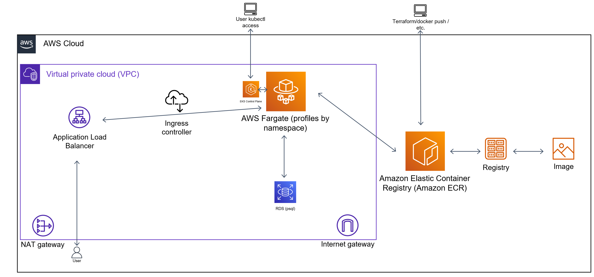

# You should start from here

## Used tools

| Name | Version |
|------|---------|
| terraform | v1.4.4 |
| aws-cli | v2.11.11 |
| docker | v20.10.21 |
| kubectl | v1.25.5 |
| helm (optional) | v3.10.1 |

# How to use this solution

1. Download this repo.
2. Be sure you have all tools from the list above.
3. Create an IAM user with an `AdministratorAccess` policy and access key (this is only for this homework, never do this in normal cases).
4. Configure your aws-cli to consume this IAM user, with the `eu-west-2` region and the `default` profile.
3. cd to the `terraform` dir.
4. `terraform init` -> `terraform plan` -> `terraform apply`
6. Wait and relax. Maybe a good strong cuppa?
7. Go back to the main dir and run `docker_bp_kubeconfig.sh`. It should log in you to the ECR repo, build the image, tag the image, push the image and log in you to the EKS cluster (and switch the context). Should output cluster information.
8. Check if aws-lb and metrics-server work correctly (they should be running). If not, sometimes you need to `rollout restart` them to trigger the Fargate scheduler once again.
9. If everything is fine, you should run the next script, named `k8s_deploy.sh`. It should replace RDS URL and ECR image location to correct ones from the terraform output in the deployment file, create the ns and apply resources (deployment, service, ingress and HPA)
10.  Now you need to wait once again. You can run for example the `watch kubectl get pods,ingress,hpa -n app-faceit` command. After some time you should get ALB URL, but wait for `1/1 Running` next to pods and metrics for HPA. This should take up to 5 minutes. You can curl the ALB URL or open it in the web browser. You need to add to the end `/health` path. If you see `UP` everything is fine and ready.
11. To be able to use `terraform destroy` correctly, without any non-removable warnings and orphan ALB from the app, you should run before it `k8s_delete.sh` script. It will remove the app resources (together with triggering ALB removal) and ECR images from the repository.
12. Go once again into the `terraform` directory and run `terraform destroy`.

# Diagram

# General notes about the solution

1. The entire solution is based on AWS cloud where I used ECR for private docker images registry, VPC for the networking layer, RDS for psql db, EKS for orchestration with Fargate profiles, IAM policies for some of the configuration and access profiles and finally helm to deploy metrics server and ingress controller for ALB.
2. I used some Terraform modules prepared for AWS to speed up this a little because I had a bad experience with AWS and they blocked my account due to suspicious activities, and I never worked so much with Terraform as with CloudFormation before and I was worried that I wouldn't be able to end this task before the deadline.
3. Some values are hardcoded to avoid using huge/expensive instances.
4. Outputs are only used for some bash scripts to speed up docker build/push and to edit k8s resources.
5. For the app I used a super simple Dockerfile.
6. I used Fargate profiles for flexibility and cost efficiency. I also never used it before and this was fun to test it.
7. VPC is mostly private, but EKS access is open (you still need to authorize yourself) and this same of course with potential ALB.
8. Psql RDS db is based on the typical instance, not on Aurora.
9. 3 main Fargate profiles are provided - for the app, for the ingress and metrics, and for the system solutions (e.g. coredns).
10. Due to Fargate limitations, the node where you have metrics-server is not reachable by the API metrics endpoint.
11. The app is deployed as simple k8s app, with svc, ingress (ALB) and a simple HPA profile.
12. I didn't use any Terraform state storage.
13. Due to some AWS limitations around Fargate and free accounts, sometimes nodes are not spin up in the first run. This can be easily solved with a higher quota, but I can't get it for now. In this case, you can just rerun "terraform apply" and everything should be fine after.
14. Scaling is based on HPA for the app pods, Fargate profiles for k8s worker nodes, ALB for the access endpoint and RDS can be easily modified to contain replica and read-only autoscaling. The app can be replaced via the Rolling Update strategy to avoid downtimes.

# What should be done

1. I should try to avoid DRY in the code.
2. GitLab CI/CD or other solution to automate docker image build, the infra and the app deployment. GitLab variables for some non-sensitive data, separate jobs for steps, validation, and deployment via custom, small Docker images and outputs stored in the artifacts to grab them when needed and reuse for example in other jobs.
3. Dynamic variables.
4. The app probably should be as a Helm chart for easier deployment, to have a way to manage releases, rollbacks and values easier. This also means sensitive values (e.g. db password) in the secrets.
5. More granulated IAM policies.
6. Maybe instead of psql RDS the psql helm chart.
7. To manage the entire solution better, my own modules (but in this task Terraform modules were more than enough).
8. More control over VPC access between resources, EKS behind VPN/Bastion.
9. If still on RDS, probably replica instance and autoscaling.
10. Less chaotic code.
11. Maybe helm_release parts more as part of the separate CI/CD. I don't like this in the IaC.
12. Maybe Packer for the app.
13. The proper Terraform state storage.
14. Maybe Vault or cloud provider solution to store variables.
15. Monitoring based on CloudWatch and Grafana, maybe with some additional solution for app logs in Loki with Grafana Agent or Promtail. Prometheus on Thanos? Of course, depends on what is already in use.
16. Security, security and once more security. Starting from already mentioned IAMs, VPC and EKS access, but also something for apps - not running the app as the root user, maybe AppArmor for some critical stuff.
17. Granulated IAM user to deploy the solution.
